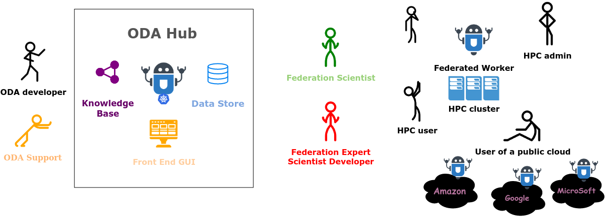

# Federated ODA Workers

## Why Federated Workers?

Providing sufficient computing resources is difficult.

Hence:

**Our goal is to assist in expoloitation of technologies facilitating grows of federation of scientific analysis workflows.**

We provide:

* **frontend**: beautiful and familiar [frontend](https://www.astro.unige.ch/cdci/astrooda_/).
* **API gateway**: RESTful-ish [API](https://github.com/cdcihub/oda_api_benchmark/) with python modules.
* **data caching**: some data will be cached directly on our storage, and hence re-used by all users.
* **knowledge base**: "open" RDF fact store, explaining relations and provenance of workflows and data. Used to search for relation between workflows and data.

## How do you take part?

* Simply **use our Online Analysis [Frontend](https://www.astro.unige.ch/cdci/astrooda_/) or [API](https://github.com/cdcihub/oda_api_benchmark/)**, leveraging the collective effort of the federation with just few clicks.
* **Empower your requests with your own hardware**, computing selected (by you) and verified (by instrument expects whom you trust anyway) analysis workflows. The analysis will store the high-level products in shared provenance-based cache, accelerating similar workflows for the community. **Community will see your contribution, will be grateful, and requested to acknowledge it**.
* **Join your own service - a remotely computable workflow** - register it in the Knowledge Base, and find that people will query it more often.
* Perhaps even **join your computing resources to provide spare computing power to other users**, **community will be very grateful and requested to acknowlage your contribution**

## Ways of connecting a federated resource

### Anonymous (Job Token) runner

### Job runners

### Session runners

### User runners

### Group runners

security implications by case

issue flow

## Credits

we loose uniqueness credits by providing the capacity to reduce data with a click of a button

compute contributors loose credit since their resources are leveraged for common good without clear attribution

## Layering data storage (cache)

## Dealing with exceptions

## Considerations of resource optimization: network vs store vs compute

* Analysis Exceptions
* Unhandled Exceptions

## Communicating Distributed Workflows

* *How do we organize communication in the federation, e.g. between the platform and the workers?*

All of them reflect general scheme, treating workflows as functions. See [details](communicating-workflows.md).

## Scheduling to the data: runner capacities

Since workflows are defined exclusively as expressions, in order to determine if runner is capable to execute the workflow, it is necessary and sufficient to determine if runner has sufficient inputs.

Inputs 

## Provenance?

benefits of provenance are numerous, see XX for details.

## Security implications of distributed analysis

unprivileged contribution

security layers:

* _solver_

* questioner
* controller

## ODA mesh

